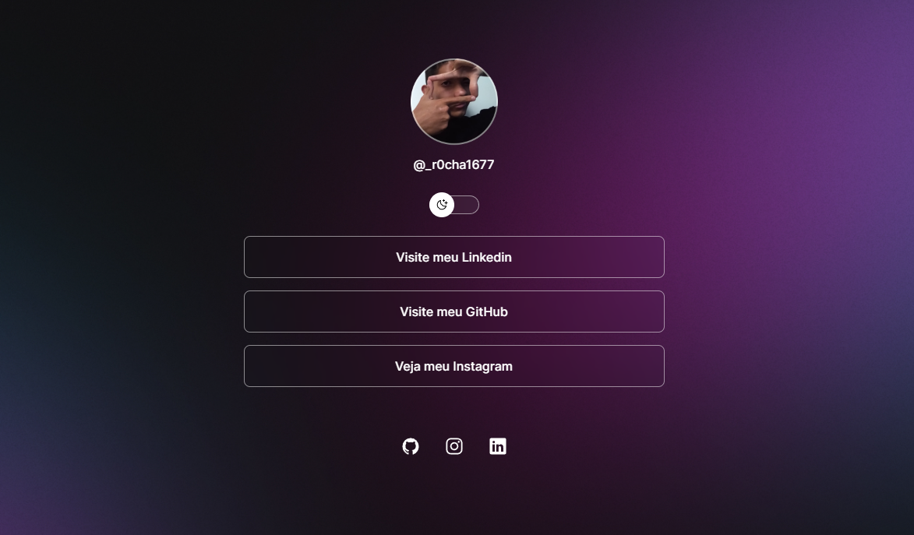

<h1 align="center"> DevLinks </h1>

Exclusive and free program, promoted by Rocketseat for teaching WEB technologies.  
<a href="https://www.rocketseat.com.br/discover">Study this project in video format by clicking here.</a>

  <a href="#-technologies">Technologies</a>&nbsp;&nbsp;&nbsp;|&nbsp;&nbsp;&nbsp;
  <a href="#-project">Project</a>&nbsp;&nbsp;&nbsp;|&nbsp;&nbsp;&nbsp;
  <a href="#-layout">Layout</a>&nbsp;&nbsp;&nbsp;|&nbsp;&nbsp;&nbsp;
  <a href="#memo-license">License</a>

  

 

  

## 🚀 Technologies

This project was developed with the following technologies:

- HTML and CSS
- JavaScript
- Git and Github
- Figma

## 💻 Project

DevLinks is a link aggregator to use as an online business card.

- [Access the finished project, online](https://aoba43.github.io/Discover/)

- [Attend classes](https://lp.rocketseat.com.br/devlinks/inscricao?utm_source=github&utm_medium=descricao&utm_campaign=capture-devlinks&utm_term=organic&utm_content=descricao-github-mayk-brito)

## 🔖 Layout

You can view the project layout through [FROM THIS LINK](https://www.figma.com/community/file/1187422022288947321). It is necessary to have an [Figma](https://figma.com) account to access it.

## :memo: License

This project is under the MIT license.
